# Doctorri – Doctor Appointment Platform

A complete doctor-booking web application:

- **Patients** find doctors by specialty, city or available day, book a time slot, cancel it and review the visit.
- **Doctors** apply with their medical documents, publish their availability, and confirm, decline or complete appointments.
- **Admins** vet doctors' documents, approve or reject them, and moderate reported reviews.

It is made of two apps in one repository:

| Part | Tech | Folder |
|---|---|---|
| REST API | Node.js · Express · MongoDB (Mongoose), organised as a **modular monolith** | [`/`](.) (`server.js`, `src/`) |
| Web app | **React 19** · React Router 8 · Vite | [`client/`](client) |

[](https://codespaces.new/musabibr/doctor-appointment-api?quickstart=1)
[](https://render.com/deploy?repo=https://github.com/musabibr/doctor-appointment-api)

Want to try it without installing anything? See [Try it online](#try-it-online-no-installation).

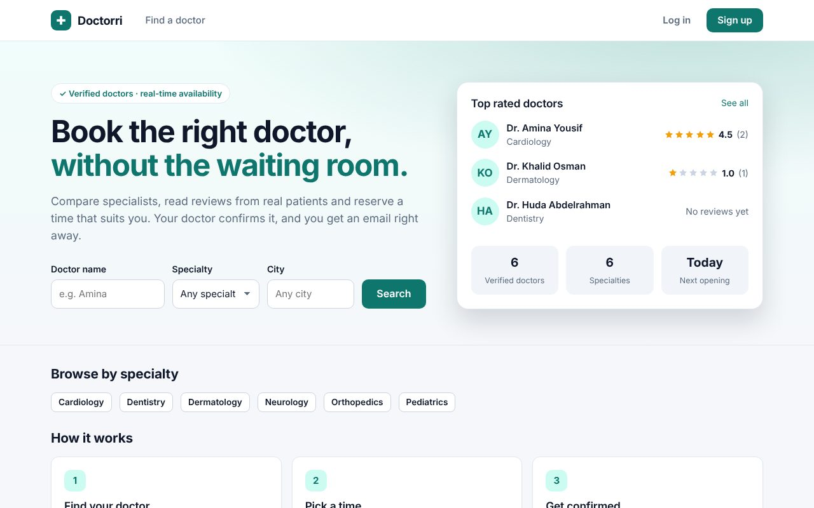

---

## Contents

1. [Try it online (no installation)](#try-it-online-no-installation)
2. [Quick start (5 minutes)](#quick-start-5-minutes)
3. [Demo accounts](#demo-accounts)
4. [Step-by-step setup](#step-by-step-setup)
5. [Everyday commands](#everyday-commands)
6. [How the app works](#how-the-app-works)
7. [Architecture](#architecture)
8. [API reference](#api-reference)
9. [Configuration](#configuration)
10. [Testing](#testing)
11. [Deploying to production](#deploying-to-production)
12. [Troubleshooting](#troubleshooting)
13. [Roadmap](#roadmap)

---

## Try it online (no installation)

Both options run the app in **demo mode**, so there is no database or email account to set up:

- an embedded MongoDB, loaded with the demo doctors, patients, appointments and reviews;
- **one-click demo logins** (patient, doctor, doctor awaiting approval, admin) on the login page;
- a **Demo inbox** page that shows every email the app would send, so testers can read verification codes and open password-reset links;
- the shared demo accounts can't have their password changed or be deleted, so testers can't lock each other out. Accounts that testers create themselves behave normally.

### Option A: GitHub Codespaces (free with your GitHub account)

[](https://codespaces.new/musabibr/doctor-appointment-api?quickstart=1)

1. Click the button, then **Create codespace**.
2. Wait for the first build (about 3–5 minutes). It installs everything, builds the web app and downloads MongoDB.
3. The app opens in a new browser tab. If it doesn't, open the **Ports** tab and click the 🌐 icon next to port **5000**.

The app is private to your GitHub account. To let someone else test it, right-click port 5000 in the **Ports** tab → **Port Visibility** → **Public** and send them the link. GitHub stops idle codespaces automatically; personal accounts include a free monthly allowance.

### Option B: Render (public link, free plan)

[](https://render.com/deploy?repo=https://github.com/musabibr/doctor-appointment-api)

1. Click the button and sign in to Render (free; you can sign in with GitHub).
2. Approve the blueprint ([`render.yaml`](render.yaml)). The first deploy takes about 5 minutes.
3. Open the `https://doctorri-demo-….onrender.com` link Render gives you and share it with your testers.

Good to know about Render's free plan: the service sleeps after 15 minutes without visitors, so the next visit takes about a minute to wake it up. Demo data is reloaded on every start and every 12 hours. To keep data permanently, add a `MONGODB_URI` environment variable (for example a free [MongoDB Atlas](https://www.mongodb.com/atlas) cluster) in the Render dashboard.

### Option C: the demo on your own computer, without MongoDB

```bash
npm run setup
npm run demo      # builds the web app and starts everything on http://localhost:5000
```

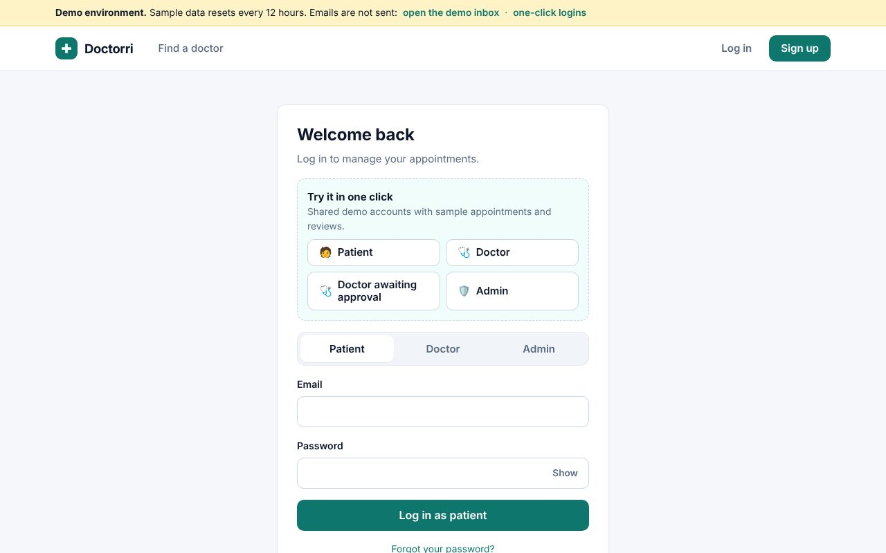 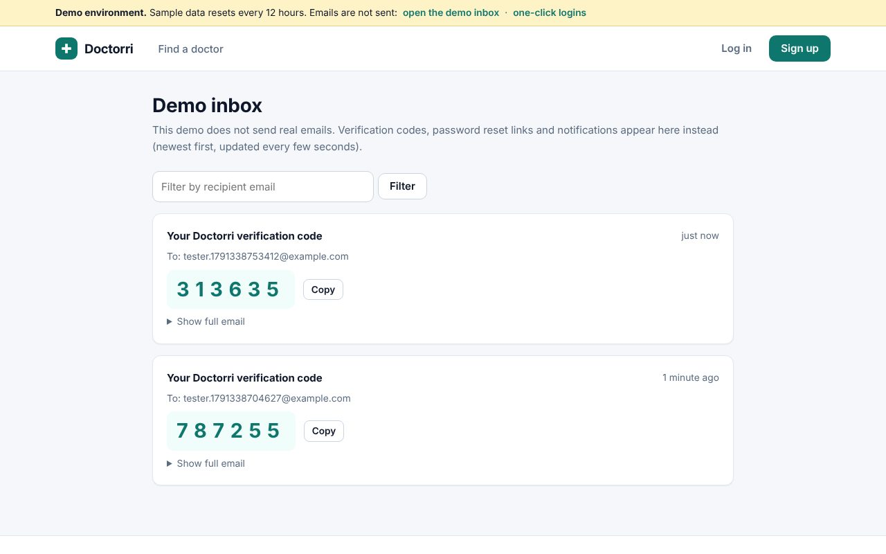

---

## Quick start (5 minutes)

You need **Node.js 22.22+ (or 24 LTS)** and a **MongoDB** server. If you don't have MongoDB yet, see [Start MongoDB](#2-start-mongodb).

```bash
git clone https://github.com/musabibr/doctor-appointment-api.git
cd doctor-appointment-api

npm run setup        # installs the API and the web app dependencies
npm run seed         # loads demo doctors, patients, appointments and an admin
npm run dev:all      # starts the API (port 5000) and the web app (port 5173)
```

Open **http://localhost:5173** and log in with one of the [demo accounts](#demo-accounts).

> No `.env` file is needed for local development: the API falls back to safe local defaults
> (`mongodb://127.0.0.1:27017/doctor_appointment`, port 5000, emails printed in the terminal).
> Copy `.env.example` to `.env` when you want to change something.

---

## Demo accounts

Created by `npm run seed`:

| Role | Email | Password | What to try |
|---|---|---|---|
| Patient | `patient@example.com` | `Patient123` | Book a slot, cancel it, review the completed visit with Dr. Khalid |
| Doctor | `doctor@example.com` | `Doctor123` | Confirm Omar's pending request, add availability |
| Doctor (pending approval) | `pending.doctor@example.com` | `Doctor123` | See the "under review" state |
| Admin | `admin@example.com` | `Admin12345` | Approve Dr. Tarig, moderate the reported review |

There are also `doctor2@example.com` … `doctor6@example.com` and `patient2@example.com` (same passwords).

---

## Step-by-step setup

### 1. Install Node.js

Install **Node.js 22.22 or newer** (the current LTS, 24, works too) from <https://nodejs.org>, then check it:

```bash
node -v    # v22.22.0 or higher
```

### 2. Start MongoDB

Pick **one** option:

| Option | How |
|---|---|
| **A. Docker** (easiest) | `docker compose up -d` from the project folder. It starts MongoDB 7 on port 27017 using [`docker-compose.yml`](docker-compose.yml). |
| **B. Install MongoDB locally** | Install [MongoDB Community Server](https://www.mongodb.com/try/download/community) (Windows/macOS/Linux) and start it. It listens on `127.0.0.1:27017` by default. |
| **C. MongoDB Atlas (cloud, free)** | Create a free cluster at <https://www.mongodb.com/atlas>, copy its connection string and set `MONGODB_URI` in `.env` (step 4). |

### 3. Install dependencies

```bash
npm run setup
```

This runs `npm install` in the project root (API) and in `client/` (web app).

### 4. (Optional) Configure environment variables

```bash
cp .env.example .env          # macOS / Linux
copy .env.example .env        # Windows (Command Prompt)
```

Every variable is optional in development. See [Configuration](#configuration) for the full list.

### 5. Load demo data

```bash
npm run seed                  # only on an empty database
npm run seed -- --reset       # wipe the database and load the demo data again
```

Prefer to start empty? Create your own admin instead:

```bash
npm run create-admin -- --email you@example.com --password "Secret123" --name "Your Name"
```

### 6. Run

```bash
npm run dev:all
```

| URL | What |
|---|---|
| http://localhost:5173 | Web app (Vite dev server with hot reload) |
| http://localhost:5000/api/v1/health | API health check |

Prefer two terminals? Run `npm run dev` (API) in one and `npm run dev:client` (web app) in the other.

### 7. Emails during development

Without SendGrid credentials, **emails are printed in the API terminal** instead of being sent. That is where you will find:

- the **6-digit verification code** when registering as a doctor;
- the **password reset link** after "Forgot password?";
- appointment notifications (new request, confirmed, canceled…).

```
========== EMAIL (printed because SENDGRID_API_KEY / EMAIL_FROM are not set) ==========
To: new.doctor@example.com
Subject: Your Doctorri verification code
...
Verification code
482913
```

---

## Everyday commands

Run them from the project root.

| Command | What it does |
|---|---|
| `npm run setup` | Install API and web app dependencies |
| `npm run dev:all` | Run the API and the web app together (stop with Ctrl+C) |
| `npm run dev` | Run only the API, restarting on file changes (`node --watch`) |
| `npm run dev:client` | Run only the web app |
| `npm run demo` | Build the web app and run everything in demo mode on http://localhost:5000 (embedded MongoDB, no setup) |
| `npm run start:demo` | Start demo mode without building (used by Codespaces and Render) |
| `npm run demo:prefetch` | Download the MongoDB binary used by demo mode ahead of time |
| `npm run seed` | Load demo data (`-- --reset` wipes the database first) |
| `npm run create-admin -- --email … --password … --name …` | Create an admin, or reset an admin's password |
| `npm test` | Run the API test suite |
| `npm run build` | Build the web app into `client/dist` |
| `npm start` | Start the API without file watching (set `NODE_ENV=production` in production); it also serves `client/dist` if it was built |
| `npm --prefix client run lint` | Lint the web app |

---

## How the app works

### Patients

1. Search doctors by name, specialty, city or a day they are free.
2. Open a profile: clinic, price, reviews and the **real open slots** (seats left per slot).
3. Pick a day and a slot and send the request. It starts as **pending** and the doctor gets an email.
4. Follow everything in **My appointments**, cancel while the slot hasn't ended, and **review** visits once the doctor marks them completed.

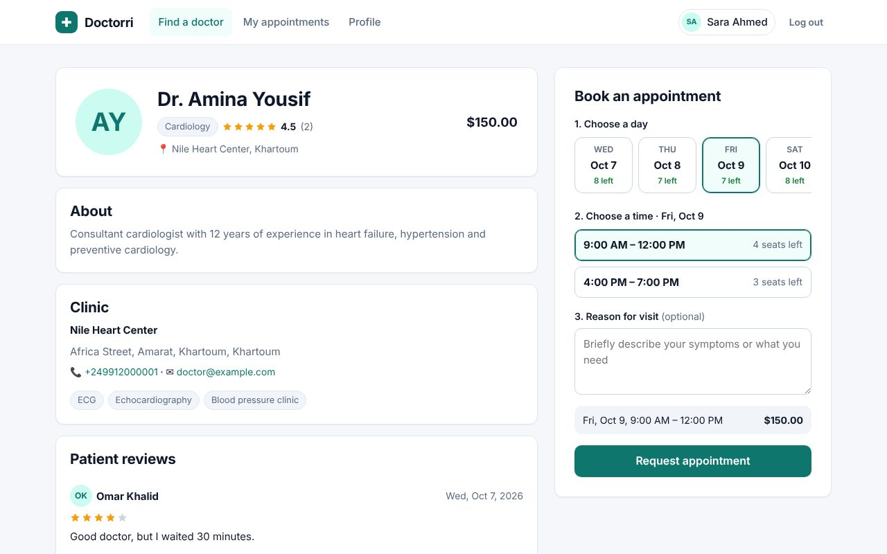 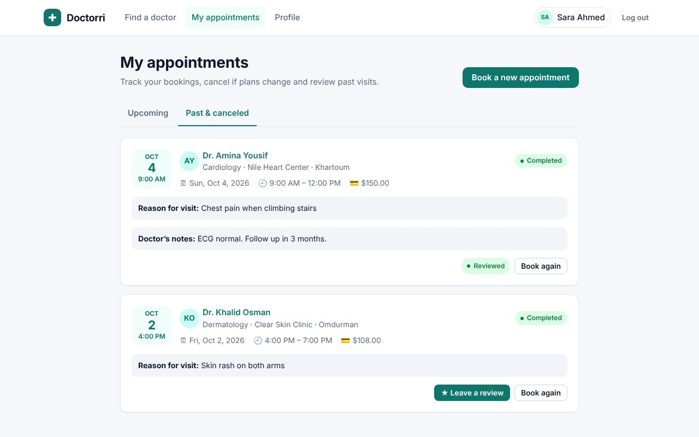

### Doctors

1. Apply with personal details, a **medical license** and a **personal ID** (JPG/PNG/WEBP/PDF, 5 MB max).
2. Verify the email with the 6-digit code (valid 10 minutes, 5 attempts).
3. Wait for an admin's approval. Meanwhile, complete the profile and clinic details. Pending doctors are hidden from patients.
4. Once approved, publish availability: days with time slots, each taking N patients, optionally repeated over the next 7 or 14 days.
5. Confirm or decline requests, cancel when needed, and mark visits **completed** (with notes for the patient) once they've started.
6. Report abusive reviews to the admins.

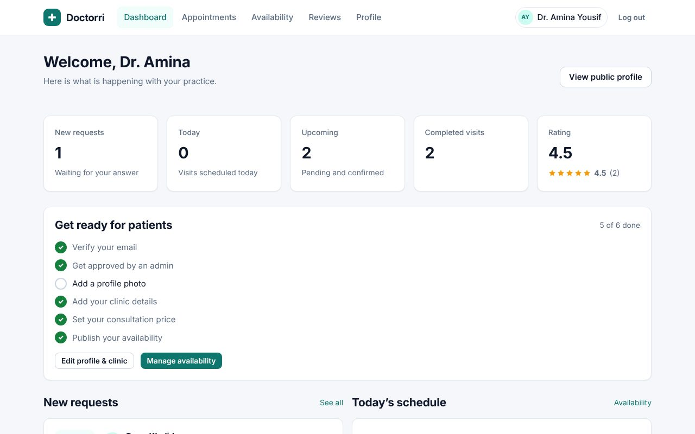 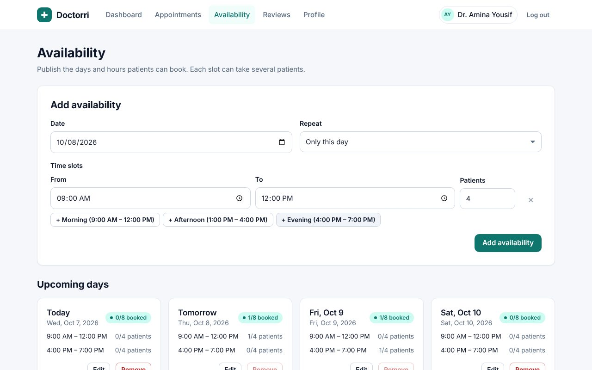

### Admins

- Review pending doctors **with their documents** (previewed in the page), then approve, or reject with a reason that is emailed to the doctor.
- Delete doctor or patient accounts. Their upcoming appointments are canceled, seats are freed, and the other side is notified.
- Keep or delete reported reviews (ratings are recalculated).
- See platform statistics and every appointment.

There is **no public admin sign-up**: admins are created with `npm run create-admin`.

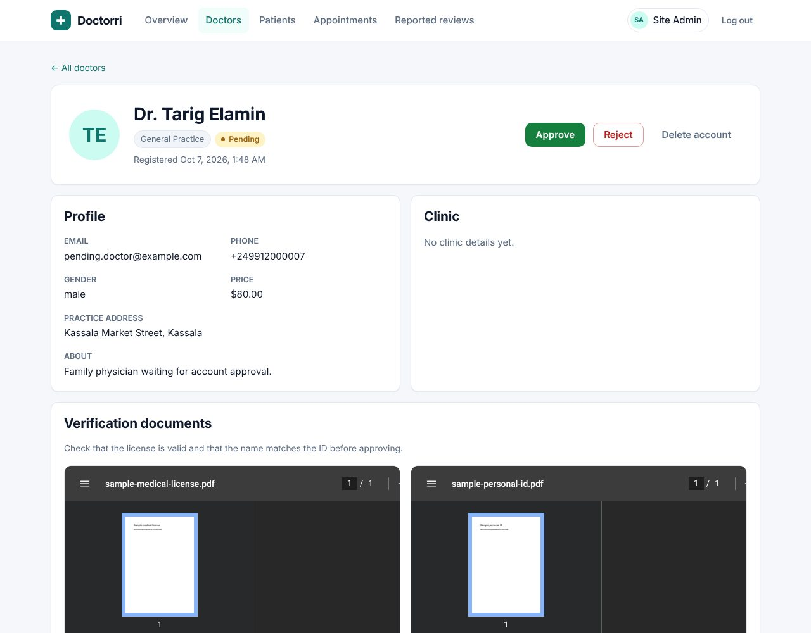 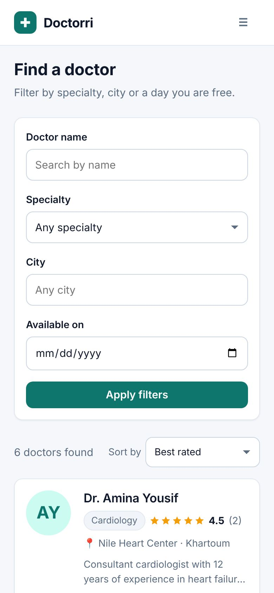

### Appointment lifecycle

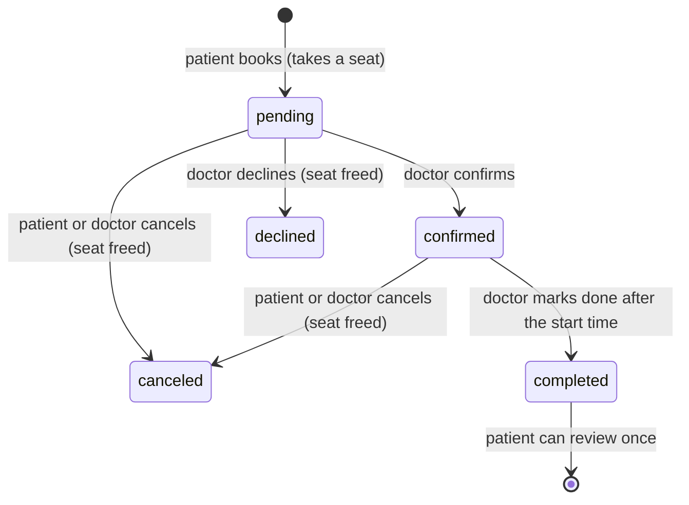

Rules enforced by the API:

- A slot never takes more patients than its capacity, even with simultaneous requests: seats are taken with an atomic compare-and-increment in MongoDB.
- A patient can hold only one active booking per slot, and cannot book a slot that has ended.
- Only the patient and the doctor of an appointment can see or change it. Anyone else gets `404`.
- Booked slots cannot be removed or moved; their capacity can't drop below the number of bookings.
- Reviews are allowed only on the patient's own **completed** appointments, one per appointment.
- "Past" is decided in `APP_TIMEZONE` (the clinics' time zone).

---

## Architecture

### Modular monolith (API)

The API is **one deployable application split into independent modules**. Each module owns its data (Mongoose models), its business rules, and its HTTP routes. Modules never reach into each other's internals: they talk through a module's **public API** (`index.js`) or through **domain events**.

```
src/
├── app.js                    # Express app: security middleware, mounts module routes, serves client/dist
├── modules/
│   ├── index.js              # Composition root: registers modules, account providers and event handlers
│   ├── auth/                 # Login, logout, passwords, email verification (OTP)
│   ├── patients/             # Patient accounts and profiles
│   ├── doctors/              # Doctor accounts, search, clinics, availability and seats
│   ├── appointments/         # Booking and the appointment lifecycle
│   ├── reviews/              # Ratings, comments and reports
│   ├── admin/                # Admin accounts and back-office endpoints
│   └── notifications/        # Turns domain events into emails
├── demo/                     # Demo mode tooling: embedded MongoDB, demo data, demo inbox routes
└── shared/                   # Shared kernel, no business logic
    ├── auth/                 # JWT, `protect` middleware, account registry
    ├── config/               # Environment and database connection
    ├── email/                # Email sending (SendGrid or console) + Pug templates
    ├── errors/               # AppError and the global error handler
    ├── events/               # In-process event bus + event catalogue
    ├── http/                 # Pagination, rate limiters, uploads, response helpers
    ├── storage/              # File storage (local disk or Cloudinary)
    └── utils/                # Logger, hashing, dates/times, validation
```

Inside a module, every file has one job:

```
modules/appointments/
├── index.js                     # PUBLIC API: the only file other modules may require
├── appointment.routes.js        # URL → middleware → controller
├── appointment.controller.js    # Validates input, calls the service, shapes the response
├── appointment.service.js       # Business rules
├── appointment.repository.js    # Database queries
├── appointment.model.js         # Mongoose schema (private to the module)
└── appointment.events.js        # Reactions to other modules' events
```

How the modules depend on each other (arrows = "uses the public API of"):

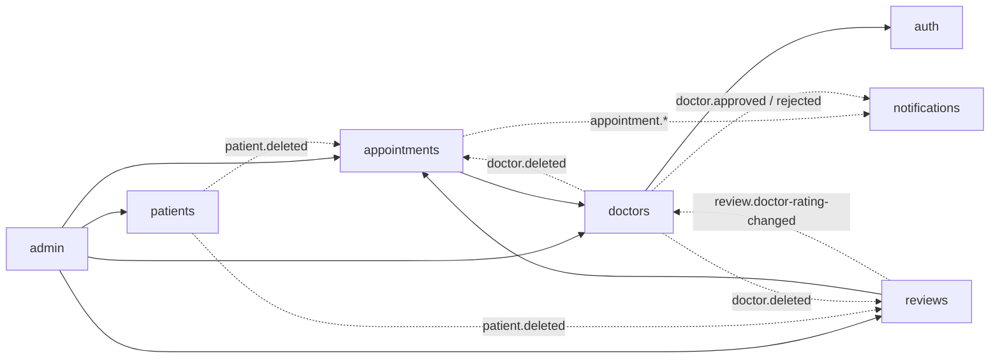

Solid arrows are direct calls; dotted arrows are events (see [`src/shared/events/events.js`](src/shared/events/events.js) for every event and its payload). Events keep modules decoupled. For example, the **reviews** module owns ratings and publishes `review.doctor-rating-changed`; the **doctors** module stores a copy for sorting, without ever importing the reviews module.

Two more mechanisms keep the boundaries clean:

- **Account registry.** `patients`, `doctors` and `admin` each register an *account provider* at start-up. The `protect` middleware and the `auth` module use it to log in or authorize any account type without importing those modules.
- **Architecture test.** [`tests/architecture.test.js`](tests/architecture.test.js) fails the build if a module imports another module's internal files, if `shared/` imports a module, or if module dependencies form a cycle.

`src/demo/` is tooling, like `scripts/`, rather than a product module: it loads the demo data straight into the models and is only loaded when `DEMO_MODE` is on.

**Adding a module:** create `src/modules/<name>/` with an `index.js` that exports `{ name, routes, registerEventHandlers?, ...publicFunctions }`, then add it to the list in `src/modules/index.js`.

### Web app (React 19)

```
client/src/
├── main.jsx, App.jsx        # Providers and routes (signed-in areas are lazy-loaded)
├── auth/                    # AuthProvider (session from the saved token), RequireRole guard
├── components/              # Layout, UI kit (Modal, ConfirmDialog, Tabs, Stars…), cards, toasts
├── features/
│   ├── public/              # Home, search, doctor profile + booking
│   ├── auth/                # Login, sign-up (patient/doctor), email verification, password reset
│   ├── patient/             # My appointments (cancel, review), profile
│   ├── doctor/              # Dashboard, appointments, availability, reviews, profile & clinic
│   ├── admin/               # Overview, doctors (+ document review), patients, appointments, reports
│   └── account/             # Photo upload and password change, shared by every role
├── lib/                     # API client, hooks, formatting helpers
└── styles/global.css        # Design tokens (light + dark mode) and components
```

React 19 features in use: **Actions** with `useActionState` for every form, `use(Context)` and `<Context value>` providers, `useEffectEvent`, native `<title>` metadata in pages, and `lazy`/`Suspense` code splitting.

In development, Vite forwards `/api` and `/uploads` to the API (see [`client/vite.config.js`](client/vite.config.js)), so the browser talks to a single origin.

---

## API reference

Base URL: `http://localhost:5000/api/v1`. Send JSON (`Content-Type: application/json`), except for the file uploads marked 📎 (`multipart/form-data`).

**Authentication.** Log in to receive a JWT, then send it as `Authorization: Bearer <token>`. Tokens contain only the account id, role and a token version: logging out or changing the password revokes every issued token.

**Responses.**

```jsonc
// success
{ "status": "success", "message": "…", "data": { … } }
// error (4xx = "fail", 5xx = "error")
{ "status": "fail", "message": "Please correct the highlighted fields",
  "code": "VALIDATION_ERROR", "errors": { "email": "Enter a valid email address" } }
```

Lists are paginated with `?page=&limit=` (max 50) and return `{ items, total, page, limit, pages }`.

### Auth: `/auth`

| Method | Path | Access | Description |
|---|---|---|---|
| POST | `/auth/login` | public | `{ role: "patient"\|"doctor"\|"admin", email, password }` → `{ token, role, user }` |
| POST | `/auth/logout` | signed in | Revokes all tokens of the account |
| GET | `/auth/me` | signed in | `{ role, user }` |
| PATCH | `/auth/me/password` | signed in | `{ currentPassword, newPassword }` → new session |
| POST | `/auth/forgot-password` | public | `{ role: "patient"\|"doctor", email }` → emails a reset link (always 200) |
| POST | `/auth/reset-password` | public | `{ role, token, password }` |
| POST | `/auth/verify-email` | public | `{ email, code }` → verifies a doctor's email and returns a session |
| POST | `/auth/resend-verification` | public | `{ email }` (one code per minute) |

### Patients: `/patients`

| Method | Path | Access | Description |
|---|---|---|---|
| POST | `/patients/register` | public | `{ name, email, password, gender, phoneNumber?, location?: { city, state } }` → session |
| GET | `/patients/me` | patient | Profile |
| PATCH | `/patients/me` | patient | `{ name?, gender?, phoneNumber?, location? }` |
| PUT | `/patients/me/photo` 📎 | patient | Field `photo` |

### Doctors: `/doctors`, `/clinics`

| Method | Path | Access | Description |
|---|---|---|---|
| POST | `/doctors/register` 📎 | public | Fields `name, email, password, gender, phoneNumber, specialty, address, about?, price?, discount?` and files `medicalLicense`, `personalID`, `photo?`. Sends the verification code. |
| GET | `/doctors` | public | Search approved doctors: `?q=&specialty=&city=&date=YYYY-MM-DD&sort=rating\|price_asc\|price_desc\|name&page=&limit=` |
| GET | `/doctors/specialties` | public | Specialties of approved doctors |
| GET | `/doctors/:id` | public | Public profile with clinic and upcoming availability (seats left per slot) |
| GET | `/clinics` | public | `?city=&state=` clinics of approved doctors |
| GET | `/doctors/me` | doctor | Own profile, approval status, clinic, availability |
| PATCH | `/doctors/me` | doctor | `{ name?, gender?, phoneNumber?, specialty?, address?, about?, price?, discount? }` |
| PUT | `/doctors/me/photo` 📎 | doctor | Field `photo` |
| PUT | `/doctors/me/clinic` | doctor | `{ name, location: { city, state, address? }, contact: { phone, email? }, services? }` |
| GET | `/doctors/me/availability` | doctor | All days |
| POST | `/doctors/me/availability` | approved doctor | `{ date, slots: [{ start: "09:00", end: "12:00", maxPatients }] }` |
| PATCH | `/doctors/me/availability/:availabilityId` | approved doctor | Same body. Keep a slot's `_id` to edit it; booked slots can only change capacity. |
| DELETE | `/doctors/me/availability/:availabilityId` | approved doctor | Only when the day has no active bookings |

### Appointments: `/appointments`

| Method | Path | Access | Description |
|---|---|---|---|
| POST | `/appointments` | patient | `{ doctorId, availabilityId, slotId, reasonForVisit? }` |
| GET | `/appointments` | patient, doctor | Own appointments: `?scope=upcoming\|history&status=&date=&page=` |
| GET | `/appointments/summary` | patient, doctor | `{ pendingRequests, upcoming, today, completed }` |
| GET | `/appointments/:id` | patient, doctor | Only the two people involved |
| PATCH | `/appointments/:id/confirm` | approved doctor | pending → confirmed |
| PATCH | `/appointments/:id/decline` | approved doctor | `{ reason? }` pending → declined |
| PATCH | `/appointments/:id/complete` | approved doctor | `{ doctorNotes? }` confirmed → completed (after the start time) |
| PATCH | `/appointments/:id/cancel` | patient, doctor | `{ reason? }` pending/confirmed → canceled |

### Reviews: `/reviews`

| Method | Path | Access | Description |
|---|---|---|---|
| GET | `/reviews/doctor/:doctorId` | public | Reviews of a doctor |
| POST | `/reviews` | patient | `{ appointmentId, rating: 1-5, comment? }`, own completed appointment only |
| DELETE | `/reviews/:id` | patient | Own review |
| POST | `/reviews/:id/report` | doctor | `{ reason }`, reviews about yourself only |

### Admin: `/admin` (admin only)

| Method | Path | Description |
|---|---|---|
| GET | `/admin/stats` | Counts of patients, doctors by status, appointments by status, reported reviews |
| GET | `/admin/doctors` | `?status=pending\|approved\|rejected&q=&page=` |
| GET | `/admin/doctors/:id` | Full profile including the verification documents |
| PATCH | `/admin/doctors/:id/approve` | Approve (the doctor is emailed) |
| PATCH | `/admin/doctors/:id/reject` | `{ reason }` (pending doctors only) |
| DELETE | `/admin/doctors/:id` | Delete; cancels upcoming appointments and removes reviews |
| GET | `/admin/patients` | `?q=&page=` |
| DELETE | `/admin/patients/:id` | Delete; cancels upcoming appointments (seats freed) and removes reviews |
| GET | `/admin/appointments` | `?status=&page=` |
| GET | `/admin/reviews/reported` | Reported reviews |
| PATCH | `/admin/reviews/:id/dismiss` | Keep the review, clear the report |
| DELETE | `/admin/reviews/:id` | Delete the review |

Example with `curl`:

```bash
TOKEN=$(curl -s -X POST localhost:5000/api/v1/auth/login \
  -H 'Content-Type: application/json' \
  -d '{"role":"patient","email":"patient@example.com","password":"Patient123"}' \
  | node -pe 'JSON.parse(require("fs").readFileSync(0)).data.token')

curl -s localhost:5000/api/v1/appointments?scope=upcoming -H "Authorization: Bearer $TOKEN"
```

---

## Configuration

API variables go in `.env` at the project root (template: [`.env.example`](.env.example)).

| Variable | Default | Notes |
|---|---|---|
| `NODE_ENV` | `development` | `production` enables strict checks and hides error details |
| `PORT` | `5000` | |
| `MONGODB_URI` | `mongodb://127.0.0.1:27017/doctor_appointment` | `MONGODB_URL_DEV` / `MONGODB_URL_PROD` from older `.env` files still work |
| `JWT_SECRET` | dev-only value | **Required in production** (32+ random characters) |
| `JWT_EXPIRES_IN` | `7d` | |
| `CLIENT_URL` | `http://localhost:5173` | Web app origin(s), comma separated: CORS + links in emails |
| `APP_NAME` | `Doctorri` | Shown in emails |
| `APP_TIMEZONE` | server time zone | e.g. `Africa/Khartoum`, decides when a slot is in the past |
| `BCRYPT_ROUNDS` | `10` | |
| `RATE_LIMIT_MAX` / `AUTH_RATE_LIMIT_MAX` | `1000` / `20` | Per IP per 15 minutes (all API calls / failed logins, sign-ups, email sends) |
| `TRUST_PROXY` | `0` | Set to `1` behind one reverse proxy so rate limits see real client IPs |
| `SENDGRID_API_KEY`, `EMAIL_FROM` | empty | Without them, emails are printed in the terminal |
| `CLOUDINARY_CLOUD_NAME`, `CLOUDINARY_API_KEY`, `CLOUDINARY_API_SECRET` | empty | Without them, uploads are saved in `./uploads` |
| `UPLOAD_DIR` | `./uploads` | |
| `ADMIN_NAME`, `ADMIN_EMAIL`, `ADMIN_PASSWORD` | – | Defaults for `npm run create-admin` |
| `DEMO_MODE` | `false` | Demo mode: demo data, one-click logins, Demo inbox, no real emails. Without `MONGODB_URI` it uses an embedded MongoDB. **Never enable it on real data.** |
| `DEMO_RESET_HOURS` | `12` with the embedded database, otherwise `0` | How often demo data is wiped and reloaded (`0` = never) |
| `PUBLIC_URL` | detected on Render and Codespaces | Public address used in email links when `CLIENT_URL` is not set |

Web app variables go in `client/.env` (template: [`client/.env.example`](client/.env.example)):

| Variable | Default | Notes |
|---|---|---|
| `VITE_API_URL` | empty | Only when the API is on another origin, e.g. `https://api.example.com` |
| `VITE_CURRENCY` | `USD` | Currency used to display prices |
| `API_PROXY_TARGET` | `http://localhost:5000` | Where the dev server forwards `/api` and `/uploads` |

---

## Testing

```bash
npm test
```

50 integration tests (Node's built-in test runner + Supertest) cover sign-up and sessions, password reset, doctor verification and approval, availability rules, search, the full appointment lifecycle including **simultaneous bookings**, ownership checks, reviews and reports, admin cascades, demo mode, and the module boundaries.

Each test file gets a throw-away database:

- By default an **in-memory MongoDB** is started with `mongodb-memory-server`. The first run downloads a MongoDB binary (~100 MB), which takes a minute.
- To use a MongoDB you already run instead (no download), point the tests at it; they create and drop their own databases:

  ```bash
  TEST_MONGODB_URI=mongodb://127.0.0.1:27017 npm test            # macOS / Linux
  set TEST_MONGODB_URI=mongodb://127.0.0.1:27017&& npm test       # Windows (cmd)
  ```

The web app is checked with `npm --prefix client run lint` and `npm run build`.

---

## Deploying to production

The simplest setup is **one Node.js server** that serves both the API and the built web app:

```bash
npm run setup
npm run build                 # builds client/dist
NODE_ENV=production npm start # serves the API and the web app on $PORT
```

Checklist:

1. Set `NODE_ENV=production`, a strong `JWT_SECRET`, `MONGODB_URI` (e.g. MongoDB Atlas) and `CLIENT_URL` (your public URL).
2. Configure **SendGrid** (`SENDGRID_API_KEY`, `EMAIL_FROM`) so verification codes and reset links are really sent.
3. Configure **Cloudinary** if the server's disk is not persistent (Render, Heroku, containers…); otherwise uploads in `./uploads` are lost on redeploy.
4. Run behind HTTPS. Behind a reverse proxy or load balancer, set `TRUST_PROXY=1`.
5. Create the first admin: `npm run create-admin -- --email … --password … --name …`.

To host the web app separately (Netlify, Vercel, S3…), build it with `VITE_API_URL=https://your-api.example.com npm run build` (in `client/`), deploy `client/dist` with a fallback to `index.html`, and add the web app's origin to the API's `CLIENT_URL`.

---

## Troubleshooting

| Problem | Fix |
|---|---|
| `Could not connect to MongoDB … ECONNREFUSED` | MongoDB is not running. Start it ([step 2](#2-start-mongodb)) or set `MONGODB_URI`. |
| `EBADENGINE` warning or syntax errors on install | Your Node.js is too old: install 22.22+ or 24. |
| `EADDRINUSE: address already in use :::5000` | Another process uses the port: stop it or set `PORT` in `.env` (and `API_PROXY_TARGET` in `client/.env`). |
| `The web client dependencies are missing` | Run `npm run setup` (it installs `client/` too). |
| The doctor verification code / reset email never arrives | In development, look in the API terminal output. In production, check the SendGrid settings and the logs in `logs/`. |
| "Too many requests" while testing | Wait 15 minutes, or raise `AUTH_RATE_LIMIT_MAX` in `.env` for local testing. |
| Logged out unexpectedly | Logging out or changing the password signs you out on all devices: log in again. |
| Data from an older version of this project behaves oddly | The data model changed (approval status, reviews, availability). Reset your local database with `npm run seed -- --reset`. |
| Render: the first visit is very slow | Free services sleep after 15 minutes without visitors; waking up takes about a minute. |
| Codespaces: the app tab didn't open | Open the **Ports** tab and click the 🌐 icon next to port 5000, or run `npm run start:demo` in the terminal. |
| `npm test` is slow the first time | `mongodb-memory-server` is downloading MongoDB once. Use `TEST_MONGODB_URI` to skip it. |

---

## Roadmap

Deliberately left out of the MVP:

- Online payments (the `isPaid` field is ready).
- Appointment reminders (e.g. a daily job emailing tomorrow's visits).
- Rescheduling in one step (today: cancel and book again).
- Refresh tokens and per-device sessions.
- Arabic translation and right-to-left layout.
- Private storage for verification documents (they are served from unguessable URLs today).

---

## License

[Apache-2.0](LICENSE)
